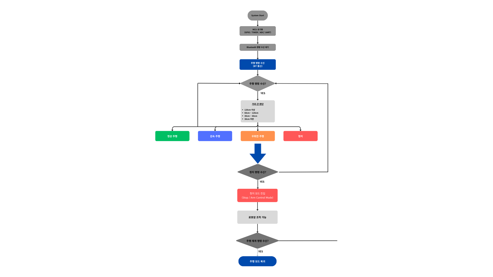

# STM32 기반 자율주행 및 수동 조작 로봇암을 갖춘 이동형 로봇 시스템

## 프로젝트 개요
본 프로젝트는 STM32F446RET6 MCU 기반 이동형 로봇 시스템으로  
초음파 센서를 이용한 장애물 감지 기반 주행 기능과 서보모터 기반 로봇암 제어 기능을 통합 구현한 임베디드 시스템입니다.

Mini 프로젝트에서 제작했던 Arduino 기반 RC카를 STM32 기반 시스템으로 확장하여 구조적으로 재설계하고 센서, 모터 제어, 통신 기능을 하나의 시스템으로 통합했습니다.

## 팀 구성 및 역할
3인 팀 프로젝트  
제 역할은 주행 제어 시스템 개발을 담당했습니다.

- DC Motor PWM 제어
- Encoder 기반 RPM 계산
- PI 제어 기반 속도 제어
- 초음파 센 기반 장애물 감지 로직 구현
- Bluetooth(UART) 기반 주행 시작 및 정지 제어

## 프로젝트 기간
2026/01 ~ 2026/03

## 프로젝트 목표
- MCU 기반 임베디드 시스템 통합 설계
- 센서 기반 자율 주행 기능 구현
- DC 모터 속도 제어 및 PI 제어 구현
- 서보모터 기반 로봇암 제어 구현

DC 모터 기반 주행 기능과 서보모터 기반 로봇암 제어 기능을 하나의 플랫폼에서 통합 구현하는 것이 목표입니다.

## 하드웨어 구성
| 하드웨어 | 역할 |
| -------- | ----------- |
| DC Motor | 이동 로봇 구동 |
| Encoder | 모터 속도 측정 |
| Motor Driver | DC 모터 제어 |
| Servo Motor | 로봇암 제어 |
| Ultrasonic Sensor | 장애물 감지 |
| Bluetooth Module | 무선 제어 |
| DC/DC Converter | 전압 안정화 |
| 18650 Battery | 전원 공급 |

로봇은 4WD 구조 이동 플랫폼 위에 로봇암을 장착한 구조로 설계

## 플로우 차트

## 타이머 설정
프로젝트에서 STM32 타이머를 활용하여 다양한 기능을 구현

| 타이머 | 모드 | 역할 |
| ----- | ------ | ------ |
| TIM2 | Input Capture  | 초음파 거리 측정 (1MHz) |
| TIM3 | PWM            | DC 모터 속도 제어 (20KHz) |
| TIM4 | Encoder Mode   | 왼쪽 엔코더 |
| TIM5 | Encoder Mode   | 오른쪽 엔코더 |
| TIM6 | 주기 갱신 Timer | 모터 제어 갱신 (10ms) |
| TIM8 | PWM            | 서보모터 제어 (50Hz) |

## 주요 기능

### 1. 주행 제어
- Bluetooth로 '1' 수신 시 주행 시작
- '0' 수신 시 정지

### 2. 거리 기반 주행 로직
- 120cm 이상 -> 정상 속도 전진
- 60 ~ 120cm -> 감속 전진
- 30 ~ 60cm -> 우회전 + 저속 전진
- 30cm 이하 -> 정지

### 3. 장애물 회피
- 특정 거리 이하에서 우측 90도 회전
- Encoder 값을 이용하여 회전 각도 제어

### 4. 속도 제어
- Encoder 기반 RPM 계산
- PI 제어를 통한 목표 속도 유지

### 5. 초음파 필터링
- 중앙값 필터 적용
- 급격한 값 변화 제거

### 6. 수동 조작 모드 (정지 상태)
- 조이스틱으로 서보모터 제어
- 버튼을 통해 제어할 서보 선택
- 갑작스러운 움직임 방지

## 코드 구성
- **My_motor**
  - 모터 제어
  - Encoder 처리
  - RPM 계산
  - PI 제어

- **main_drive**
  - TIM6 10ms 제어 루프
  - 초음파 센서 처리
  - Bluetooth 명령 처리
  - 주행 로직

※ 전체 프로젝트 코드가 아닌 주행 제어 관련 코드만 업로드 및 정리했습니다.

## 시연 영상 및 이미지
[링크](https://drive.google.com/drive/folders/1a2JxdjavZcIGtp-SCjDZ-J0IXCls4VRp)

## 느낀 점
처음에는 단순히 모터를 동작시키는 것에서 시작했지만,  
실제로 주행을 구현하면서 센서 값이 일정하지 않다는 점과 그로 인해 안정적인 제어가 어렵다는 것을 많이 느꼈습니다.

특히 초음파 센서 값이 튀는 문제와 회전 시 원하는 각도로 정확히 제어되지 않는 문제를 해결하면서  
필터링과 제어 로직의 중요성을 체감할 수 있었습니다.

또한 Timer Interrupt 기반으로 제어 구조를 구성하면서  
임베디드 시스템에서 주기적인 제어가 얼마나 중요한지도 이해하게 되었습니다.

## 아쉬운 점
- 초음파 센서 외 추가 센서를 생각하지 못한 점 (라인 트레이싱 등)
- 환경에 따라 거리값 편차 존재
- 완전한 자율주행까지는 구현하지 못함

## 개선 방향
- 라인 트레이싱 센서 추가
- PID 제어 적용
- 더 정교한 주행 알고리즘 구현
- 카메라 기반 인식 추가 (OpenCV 등)

